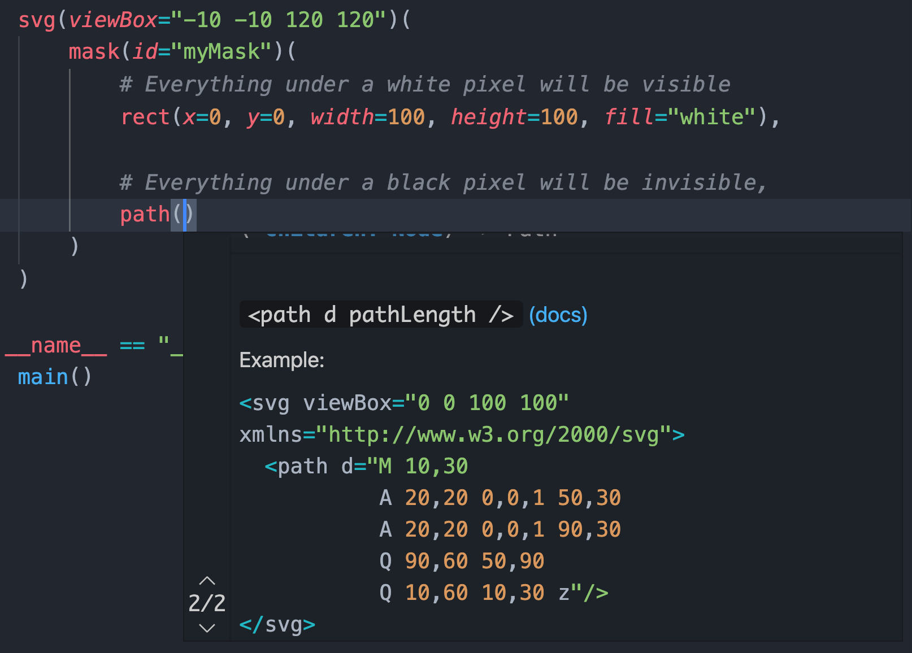

# DOM Tree

Simple API to create DOM trees in Python.
A bit like JSX, but with native Python syntax.

Aims to include useful autocompletion. Currently this works for SVGs.

## Basic example
```python
from domtree.svg import *

print(
    svg(viewBox="0 0 100 100", xmlns="http://www.w3.org/2000/svg")(
        circle(cx=50, cy=50, r=50),
    )
)

# <svg viewBox="0 0 100 100" xmlns="http://www.w3.org/2000/svg">
#   <circle cx="50" cy="50" r="50" />
# </svg>
```


## Generated content

```python
from domtree.svg import *

print(
    svg(
        circle(x=0, y=i * 10, r=2) for i in range(5)
    )
)

# <svg xmlns="http://www.w3.org/2000/svg" xmlns:xlink="http://www.w3.org/1999/xlink" version="1.1">
#   <circle x="0" y="0" r="2" />
#   <circle x="0" y="10" r="2" />
#   <circle x="0" y="20" r="2" />
#   <circle x="0" y="30" r="2" />
#   <circle x="0" y="40" r="2" />
# </svg>
```

## Custom nodes
```python
from domtree import Node

ul = Node("ul")
li = Node("li")

print(
    ul(
        li("First item"),
        li(className="second")("Second item")
    )
)

# <ul>
#   <li>
#     First item
#   </li>
#   <li class="second">
#     Second item
#   </li>
# </ul>
```

## Autocomplete


